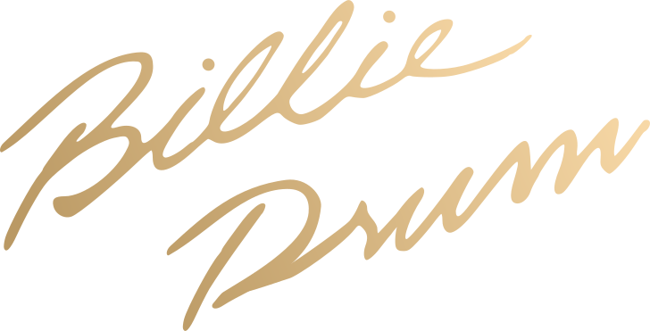

# 
A SFZ drum kit inspired by the music of Michel Jackson

This SFZ drum kit was inspired by the iconic sound of Michel Jackson's *Thriller* album. It was made using a blend of both acoustic and digital drum samples to emulate the energizing backbone of this seminal album.

This drum kit uses 44.1kHz samples, and should work with any SFZ sampler.

Happy music making!

If you're like to support me [donate money](paypal.me/ewonrael)!
